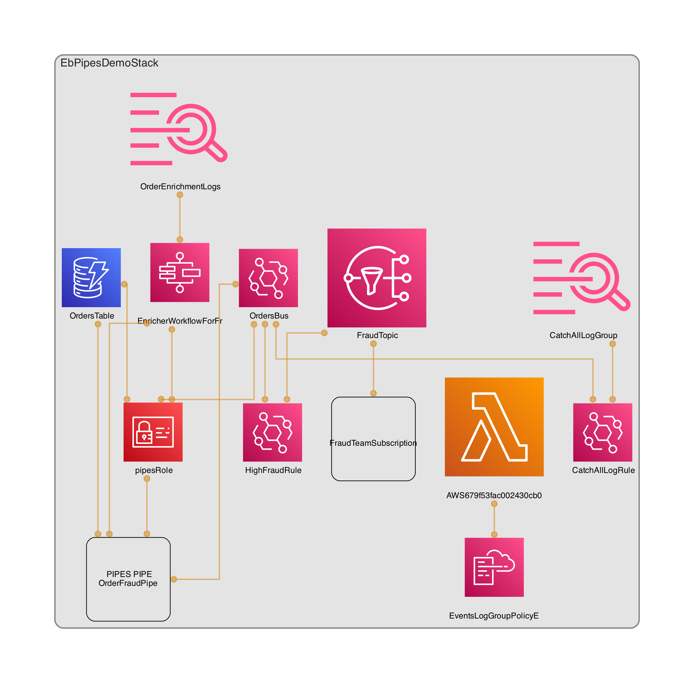
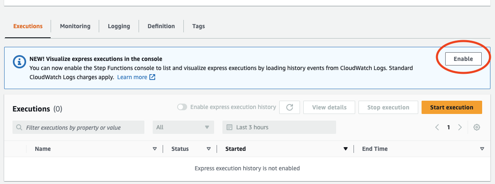

# EventBridge Pipes Demo

This is a personal learning project by Ben Moses. The objective is to learn AWS CDK by doing, and to experiment with [EventBridge Pipes](https://docs.aws.amazon.com/eventbridge/latest/userguide/eb-pipes.html).

> ⚠️ Deploying any resources to an AWS account that you own may incur charges and you are responsible for managing this. See [here](https://aws.amazon.com/blogs/aws-cloud-financial-management/getting-started-with-aws-budgets/) for instructions on how to manage costs.

> This code come with zero warranty and you are responsible for activity in your AWS account.

If you have any feedback, or ideas for me to improve the TypeScript quality in this project, please Tweet me @benmosesUK

## How to use this demo

This demo uses EventBridge Pipes to connect a DynamoDB stream to an EventBridge bus to emit domain events. While message are travelling down the pipe, they are filtered and enriched.

The filtering uses the same pattern types as EventBridge Rules. In the context of this demo they filter out all messages apart from `INSERT` messages in to the DynamoDB table that have the required fields present.

Enrichment is provided by a Step Functions Express workflow that performs two actions. First, it reformats the message in to the shape for a domain event. Lastly, it mocks a call to a fraud checking service by using a `Pass` state and the `States.MathRandom()` [intrinsic function](https://docs.aws.amazon.com/step-functions/latest/dg/amazon-states-language-intrinsic-functions.html).


_(automatically generated with **[cdk-dia](https://github.com/pistazie/cdk-dia)**)_

<!--  -->

### Deployment instructions

> 💡 **Assumption**: you must have `npm` and `cdk` installed to use this demo as well as `AWS CLI` with a configured profile. [NPM](https://docs.npmjs.com/downloading-and-installing-node-js-and-npm/) | [AWS CDK](https://docs.aws.amazon.com/cdk/v2/guide/getting_started.html) | [AWS CLI](https://docs.aws.amazon.com/cli/latest/userguide/getting-started-install.html)

1. In the root of the project create a file named `.env` and add `NOTIFICATION_EMAIL=nowhere@example.com` changing the value from _'nowhere@example.com'_ to your email address. (this is the e-mail address SNS will use to send "fraud" order messages to)
2. In the root of the project, in your terminal run `npm install` to install all project dependencies.
3. _(Optional)_ if you have never used AWS CDK with your target AWS account then you need to run `cdk bootstrap` to prepare your account for use with AWS CDK.
4. Once you're ready run `cdk deploy`.

The stack is now deployed and ready to use.

### Using the demo

1. In the output of the CDK deploy operation above will be the name of the DynamoDB Table. In your `.env` file add a new entry for the DynamoDB table, for example `TABLE_NAME=EbPipesDemoStack-OrdersTable-someGUIDhere` replacing the table name with the value from the CDK output. It should now look something like:

```bash
NOTIFICATION_EMAIL=myemail@domain.com
TABLE_NAME=EbPipesDemoStack-OrdersTable123456789
```

2. Ensure you have [ts-node](https://www.npmjs.com/package/ts-node) installed globally using `npm install -g ts-node`
3. Lastly, run `ts-node ./generator.ts`.

If you are logged in to a valid AWS session, this will attempt to write 25 new entries to your DynamoDB table with valid field names and random values. Ensure you see a _200_ response.

At this point, you can now inspect the causal chain of AWS services involved to see the interaction from end to end with:

- Dynamo DB
- EventBridge Pipes
- Step Functions
- CloudWatch Logs
- SNS

> 💡 If the Step functions console doesn't show you the execution history. Click the button to enable execution history in express workflows (see screenshot)



### Deleting the stack

When you are ready to delete the stack simply run `cdk destroy` and confirm that you want to delete the stack.

> ⚠️ If you have modified any resources in the console then deletion may fail. If it does, open the [CloudFormation Console](https://console.aws.amazon.com/cloudformation/), click in to the stack and look at the errors in the _Events_ tab to troubleshoot.

---

## Outstanding ideas

- Build a CloudWatch dashboard that shows the end-to-end metrics from entry of an item in to the DynamoDB table, the DynamoDB stream, EventBridge Pipe, Step Functions enrichment workflow, and the EventBridge bus.
- Build a test suite to extend the scaffolded jest framework.
- When this demo was created (April 2023), there was no Level 2 CDK Construct for EventBridge Pipes. There is an [open Github issue](https://github.com/aws/aws-cdk-rfcs/issues/473) for a community contribution of an L2 Construct. Once an L2 construct exists, this demo will be updated to make use of it.

## Useful commands

- `npm run build` compile typescript to js
- `npm run watch` watch for changes and compile
- `npm run test` perform the jest unit tests
- `cdk deploy` deploy this stack to your default AWS account/region
- `cdk diff` compare deployed stack with current state
- `cdk synth` emits the synthesized CloudFormation template
